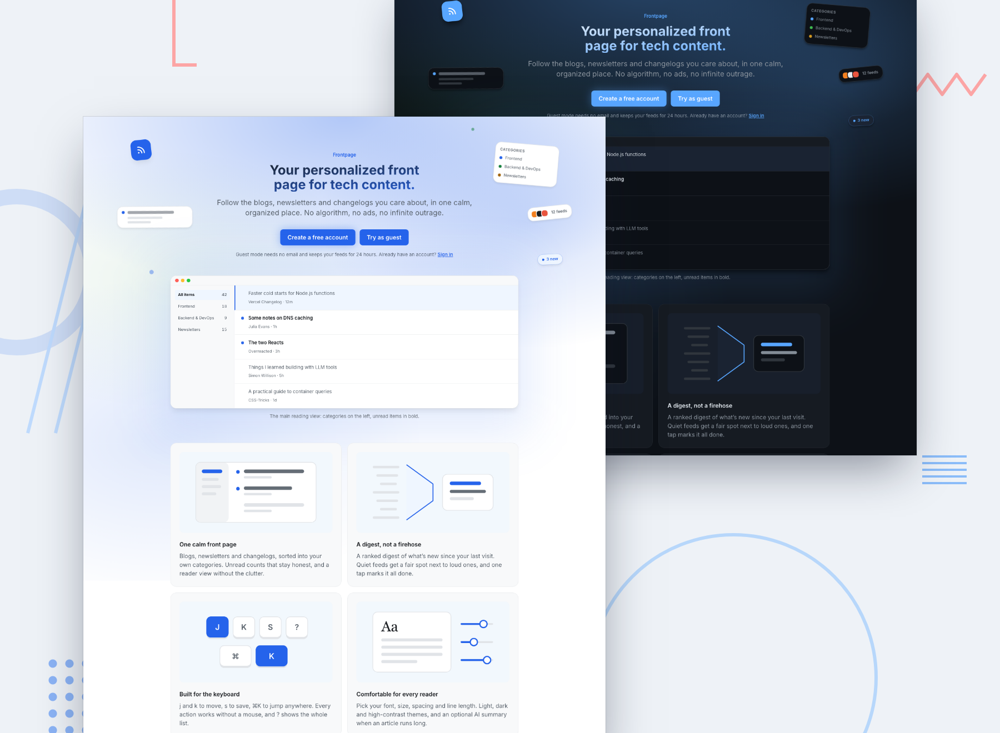

# Frontpage

A customizable content aggregator that pulls RSS and Atom feeds into one calm, well-organized reading dashboard.



---

## Overview

Frontpage turns the blogs, newsletters and changelogs you follow into one front page. You can start as a guest with real feeds already loaded, or create an account. From there you can organize feeds into categories, read in a distraction-free reader, save items, search everything, and get a ranked digest of what you missed. Every action works from the keyboard, and the reader adapts to your font, size, spacing, line length and theme.

### Tech Stack

| Layer          | Technology                                                                                                           |
| -------------- | -------------------------------------------------------------------------------------------------------------------- |
| Framework      | Next.js 16 (App Router, Server Actions), React 19, TypeScript                                                        |
| Database       | PostgreSQL via Prisma 7 (`@prisma/adapter-pg`); Neon in production                                                   |
| Authentication | Better Auth (email + password, anonymous guests, guest → account linking)                                            |
| Hosting        | Vercel (daily cron for maintenance)                                                                                  |
| Styling        | Tailwind CSS 4 with the brand tokens in `src/app/tokens.css`                                                         |
| Other          | htmlparser2 + sanitize-html (parsing and sanitizing), next-themes, cmdk, Google Gemini API via `fetch` (optional AI) |

---

## Design Decisions

### Content Discovery & Onboarding

**The problem I was solving:** an empty RSS reader is a dead end. Most people don't know feed URLs.

**My approach:**

- Guests land on a front page that already has real feeds.
- New accounts with no subscriptions see starter packs (curated bundles by topic), subscribed with one click.
- They can also add a feed by URL or import OPML. Adding a site's homepage URL discovers its feed automatically.
- A guest who signs up keeps everything they did as a guest: subscriptions, read state, saved items and preferences.

**Why I chose this approach:** it's value in the first second, with no email wall, and nothing is lost when someone commits.

### Digest / Summary View

**The problem I was solving:** "What did I miss?" without scrolling 300 items, and without loud feeds drowning out quiet ones.

**My approach:**

- `/app/digest` has three windows: since your last digest, the last 24 hours, and the last week.
- Each unread item is scored `0.5^(age h / 12) / log2(2 + items the feed published this week)`. That favors fresh items and gives a rare post from a quiet blog a fair chance against a busy changelog.
- Items are grouped by category, with at most 2 per feed and 5 per group. Each group has an "N more" link to the full list.
- Fewer than 8 items is a quiet stretch, so the page shows a flat list ending in "That's everything".
- "Done" marks exactly the items shown as read and starts the next window from now.
- With an API key set, Gemini can add a 3–5 sentence briefing above the groups. It's cached per window.

**Why I chose this approach:** ranking is pure, deterministic and unit-tested (`src/lib/digest/rank.ts`). AI is an extra on top, not a dependency.

### Layout Customization

**The problem I was solving:** different moments call for different density: triage versus browsing.

**My approach:**

- There are three layouts, switched from the toolbar or the ⌘K palette, and remembered per account:
  - **Compact:** one line per item.
  - **Comfortable:** title, two-line excerpt and thumbnail.
  - **Cards:** an image-led grid where the whole card is clickable. Items without an image show their title on a gradient tinted by the feed.
- On phones, Compact stacks its meta line and Cards becomes a single column.

**Why I chose this approach:** one global setting keeps a single mental model. Per-category layouts were left out on purpose.

### Other Design Choices

**Reading and accessibility:**

- Reader typography (font, size, line height, line length) with a live preview.
- Light, dark, system and high-contrast themes. High contrast is ≥ 7:1 and turns on automatically under `prefers-contrast: more`.
- A Reduce motion preference.
- One polite live region announces refreshes, new items and bulk actions.
- See [`/accessibility`](src/app/accessibility/page.tsx) and the [audit](docs/accessibility-audit.md).

**Keyboard:**

- `j`/`k` move, `o` opens, `s` saves, `m` toggles read, `u` goes back.
- `g h`/`g s`/`g f` jump to sections, and `/` opens search.
- `?` shows the shortcut sheet, and ⌘/Ctrl-K opens the command palette.
- Single-key shortcuts are ignored while you're typing or a dialog is open.

**Contrast fixes to the brand kit:**

- Some stock tokens fail WCAG AA for small text, so these were changed:
  - light `--color-text-tertiary` → `#656d76` (4.98:1)
  - light `--color-warning` → `#a16207`
  - light `--color-success` → `#15803d`
  - dark `--color-text-tertiary` → `#848d97` (4.52:1)

**Landing page:** a live HTML rendering of the reading view instead of a screenshot. It's always crisp, follows the theme and never goes stale. Sign up and Try as guest get equal weight.

### Data and infrastructure decisions

- **Indexes:** `Item(feedId, publishedAt desc)` serves the all, category and feed views, since each resolves to a set of feed ids. A GIN index on a generated `tsvector` powers search.
- **Unsubscribing:** deletes the subscription and the user's unsaved item states for that feed. Saved items survive.
- **Growth:** only items a user has touched get an `ItemState` row. The daily cron deletes:
  - items older than 90 days that nobody saved
  - feeds with no subscribers and no saved items
  - expired guests
  - old AI bookkeeping
- **Fetching:** on demand and stale-while-revalidate.
  - Page loads refresh due feeds in `after()`.
  - The Refresh button forces a refresh of the current scope, with a 60 s minimum interval per feed.
  - The list polls on your chosen interval and shows "Show N new items" without moving your scroll position.
- **Hostile feeds:** 10 s timeout, at most 5 redirects, a 5 MB body cap, SSRF blocking of private and loopback addresses. HTML is sanitized at ingest, and titles always render as text.
- **Dedup:** on `(feedId, guid)`, where guid is `<guid>`/`<id>`, then the link, then a hash. The first stored version wins.
- **Scoping:** every query and Server Action scopes by the session user id, including item ids the user isn't subscribed to.

---

## Development Journey

The work ran in ten planned phases. Each plan is in [`docs/plans/`](docs/plans), starting from the [roadmap](docs/plans/2026-10-08-frontpage-roadmap.md):

1. Foundation, feed fetching and parsing
2. Accounts and guests
3. The reading core
4. Feeds and categories
5. Bookmarks, search and OPML
6. Refresh and polling
7. Layouts and digest
8. Accessibility and keyboard
9. AI summaries
10. Landing and deploy prep

### Initial Approach vs. Final

The roadmap held up: ten phases, built in order, each with its own plan. The main change came late. AI summaries first shipped on the Anthropic API and then moved to Gemini's free tier, so a public demo costs nothing to run.

### Decisions Reconsidered

- **AI provider:** Anthropic → Gemini (free tier, plain `fetch`, no SDK).
- **Mark all read:** limited to items already seen, with undo restoring the exact rows, so new arrivals aren't marked read without being seen.
- **Truncation check:** rewritten to run in linear time after comment-heavy feeds could freeze the server.
- **Redirect safety:** `next` paths are now resolved the way a browser resolves them, so tab-prefixed values can't send users off-site.

### What Surprised Me

How much of the parser ended up being defensive code for feeds that don't follow the spec, each case now covered by a test in `src/lib/feeds/`:

- **Encodings:** charsets come from the HTTP header, the XML declaration or a byte order mark, and they sometimes disagree. Bytes labelled UTF-8 that aren't valid UTF-8 fall back to Windows-1252.
- **Truncation:** some feeds arrive cut off mid-item or with bare `&` characters. They're parsed as far as possible, and the cut-off last item is dropped.
- **Dates:** ISO dates without a time zone, RFC 822 variants and zone abbreviations JavaScript doesn't know all need handling. Dates that can't be used become `null` instead of crashing.
- **Hostile content:** NUL characters that Postgres rejects, tracking pixels, and comment-heavy feeds that made a naive check run in quadratic time.

---

## AI Collaboration Reflection

### How I Used AI

Each phase began with a written plan (`docs/plans/`) that was reviewed before any code was written. Implementation was done in small commits, one concern each, verified with `pnpm test`, `lint`, `typecheck` and `build`.

---

## Differentiators

### Chosen Differentiator(s)

**1. Accessibility-first reading**

**Why I chose this:** people who read for a living deserve a reader that adapts to them, not the reverse.

**How it enhances the product:** typography controls, AAA high contrast, reduce motion, full keyboard control and screen reader announcements are first-class settings, not afterthoughts.

**Implementation highlights:**

- Reader preferences become CSS custom properties, so the live preview is the real styles.
- One announcer context replaces scattered live regions.
- Selecting a row with j/k simply moves focus, so the selection is always where screen readers and Enter expect it.

**2. AI summaries and digest briefing**

**Why I chose this:** to skim long articles and catch up faster.

**How it enhances the product:** on-demand two-paragraph article summaries, and a short "what happened" briefing on the digest.

**Implementation highlights:**

- **Model:** `gemini-3.5-flash` through the REST `generateContent` endpoint (free tier, no SDK). Blocked or safety-stopped replies are treated as unavailable.
- **Caching:** summaries are stored on `Item`, so they're shared across users and an item is summarized once, ever. Briefings are cached per user per window.
- **Limits:** a daily cap per user (5 for guests, 50 for accounts), enforced with one atomic SQL upsert.
- **Errors:** a rate limit (HTTP 429) shows "try again"; other errors and timeouts (30 s) hide the panel quietly and are logged on the server.
- **Without a key:** every AI control disappears when `GEMINI_API_KEY` is unset.

**Cost note:** the free tier covers a demo. Summaries are cached, so usage scales with distinct articles summarized, not page views. The model is one constant in `src/lib/ai/client.ts`. On the free tier, Google may use prompts to improve its products; prompts here are public article text and headlines only.

---

## Self-Assessment

| Category                        | Rating | Notes |
| ------------------------------- | ------ | ----- |
| **Works for real users**        | /5     | 5     |
| **Feed parsing robustness**     | /5     | 5     |
| **Design-it-yourself features** | /5     | 5     |
| **Design quality**              | /5     | 5     |
| **Responsive design**           | /5     | 5     |
| **Performance**                 | /5     | 5     |
| **Accessibility**               | /5     | 5     |
| **Edge case handling**          | /5     | 5     |
| **Code quality**                | /5     | 5     |
| **Landing page**                | /5     | 10    |
| **Guest experience**            | /5     | 100   |

### Lighthouse Scores

_Run Lighthouse against the deployed URL._

| Category       | Score |
| -------------- | ----- |
| Performance    |       |
| Accessibility  |       |
| Best Practices |       |
| SEO            |       |

### Strengths

- **Robust parsing:** RSS 2.0, RSS 1.0/RDF and Atom, with the malformed real-world cases above covered by unit tests.
- **Guest to account:** guests get real feeds immediately, and signing up keeps everything they did.
- **Accessibility:** typography controls, high contrast, reduce motion, full keyboard control and screen reader announcements.
- **Digest ranking:** deterministic and unit-tested, with AI as an optional extra rather than a dependency.

### Areas for Improvement

- **No end-to-end tests:** the test files are unit tests. Flows like sign-up, guest upgrade and password reset are only verified by hand.
- **Lighthouse not yet run** against the deployed URL (see the table above).
- **Three differentiators not built:** offline reading, newsletter email integration and reading analytics.
- **Preferences stored per browser:** collapsed sidebar categories live in `localStorage`, so they don't follow an account across devices.

---

## Known Limitations

- Edited articles aren't re-synced: the first stored version of an item wins.
- An item purged after 90 days can come back (as read) if it's still in the feed's XML.
- Polling, not push: new items appear at most every 15 minutes, or when you press Refresh.
- No split-pane reader on wide screens yet.
- OpenDyslexic isn't offered (it isn't on Google Fonts). Atkinson Hyperlegible is.
- Theme choice is stored per device, not per account.
- `lang` isn't detected for foreign-language feed content.
- A VoiceOver/NVDA pass is still pending (see the audit).

---

## Running Locally

```bash
git clone https://github.com/elshanx/frontpage
cd frontpage
pnpm install
cp .env.example .env   # fill in DATABASE_URL and BETTER_AUTH_SECRET at minimum
pnpm db:migrate
pnpm dev
```

Checks: `pnpm test`, `pnpm lint`, `pnpm typecheck`, `pnpm build`.

### Environment Variables

| Variable             | Description                                                                             |
| -------------------- | --------------------------------------------------------------------------------------- |
| `DATABASE_URL`       | PostgreSQL connection string                                                            |
| `BETTER_AUTH_SECRET` | 32+ character secret (`openssl rand -base64 32`)                                        |
| `BETTER_AUTH_URL`    | Public base URL of the app                                                              |
| `RESEND_API_KEY`     | Optional. Sends password reset emails; without it they're logged to the console         |
| `EMAIL_FROM`         | Sender for those emails                                                                 |
| `CRON_SECRET`        | Optional. Protects `/api/cron/maintenance` (Vercel sends it automatically)              |
| `GEMINI_API_KEY`     | Optional. Enables AI summaries and digest briefings (free key from aistudio.google.com) |

### Deploying

1. Create a Neon Postgres database and copy its pooled connection string.
2. Import the repo in Vercel. Set the variables above. `BETTER_AUTH_URL` is the production URL.
3. Deploy. The `vercel-build` script runs `prisma migrate deploy && next build`, and `vercel.json` schedules the daily maintenance cron.
4. Run Lighthouse on the live URL and fill in the scores above.

---
